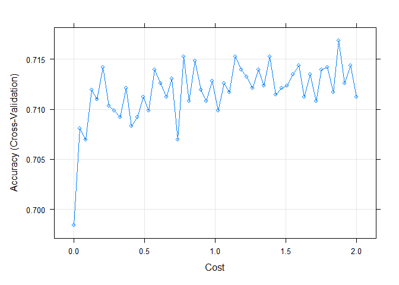

Assignment 6
================
Chee Kay Cheong
2023-02-21

``` r
knitr::opts_chunk$set(message = FALSE, warning = FALSE)

library(tidyverse)
library(rpart) # construct CaRT
library(caret) # construct CaRT
library(rpart.plot) # makes cleaner looking tree plots
library(pROC) # generate ROC
library(e1071) # SVM 
library(NHANES)
```

# Part 1

## Load and clean dataset, Data Partitioning

Restrict the `NHANES` data to the list of 11 variables below.

Variables: “Age”, “Race1”, “Education”, “HHIncome”, “Weight”, “Height”,
“Pulse”, “Diabetes”, “BMI”, “PhysActive”, “Smoke100”.

``` r
# Load dataset
data("NHANES")

# Select variables, clean dataset, remove missing values, set reference group for outcome
nhanes = NHANES %>% 
  janitor::clean_names() %>% 
  select(age, race1, education, hh_income, weight, height, pulse, diabetes, bmi, phys_active, smoke100) %>% 
  drop_na() 

# Set 'No' as reference level for `diabetes`
nhanes$diabetes = relevel(nhanes$diabetes, ref = "No")

# Check proportion of outcome 
nhanes %>% 
  select(diabetes) %>% 
  group_by(diabetes) %>% 
  count()
```

    ## # A tibble: 2 × 2
    ## # Groups:   diabetes [2]
    ##   diabetes     n
    ##   <fct>    <int>
    ## 1 No        5697
    ## 2 Yes        659

``` r
# Yes = 659, No = 5697, Not balanced...
```

Partition the data into training and testing using a 70/30 split.

``` r
set.seed(123)

training.index = 
  nhanes$diabetes %>% 
  createDataPartition(p = 0.7, list = F)

training = nhanes[training.index, ]
testing = nhanes[-training.index, ]

# I want to see if I have enough outcomes in my training dataset and if I should do "up" or "down" sample.
training %>% 
  select(diabetes) %>% 
  group_by(diabetes) %>% 
  count()
```

    ## # A tibble: 2 × 2
    ## # Groups:   diabetes [2]
    ##   diabetes     n
    ##   <fct>    <int>
    ## 1 No        3988
    ## 2 Yes        462

# Part 2 & 3

## Construct 3 prediction models, choose hyperparameters, and compare performance

### Classification Tree

``` r
set.seed(123)

# Create 10-fold cross-validation and use up-sampling because of imbalance in outcome
train.control = trainControl(method = "cv", number = 10, sampling = "up")

# Create sequence of cp parameters to try 
grid = expand.grid(cp = seq(0.001, 0.5, by = 0.01))

# Train model
class_tree = train(diabetes ~ ., data = training, method = "rpart", trControl = train.control, tuneGrid = grid)

# Find best tune cp
class_tree
```

    ## CART 
    ## 
    ## 4450 samples
    ##   10 predictor
    ##    2 classes: 'No', 'Yes' 
    ## 
    ## No pre-processing
    ## Resampling: Cross-Validated (10 fold) 
    ## Summary of sample sizes: 4005, 4005, 4004, 4005, 4005, 4006, ... 
    ## Addtional sampling using up-sampling
    ## 
    ## Resampling results across tuning parameters:
    ## 
    ##   cp     Accuracy   Kappa      
    ##   0.001  0.8368420  0.388162919
    ##   0.011  0.6963736  0.226574747
    ##   0.021  0.6559468  0.192460702
    ##   0.031  0.6507666  0.189658320
    ##   0.041  0.5757426  0.143580468
    ##   0.051  0.5658550  0.139048839
    ##   0.061  0.5658550  0.139048839
    ##   0.071  0.5658550  0.139048839
    ##   0.081  0.5658550  0.139048839
    ##   0.091  0.5658550  0.139048839
    ##   0.101  0.5658550  0.139048839
    ##   0.111  0.5658550  0.139048839
    ##   0.121  0.5658550  0.139048839
    ##   0.131  0.5658550  0.139048839
    ##   0.141  0.5658550  0.139048839
    ##   0.151  0.5658550  0.139048839
    ##   0.161  0.5658550  0.139048839
    ##   0.171  0.5658550  0.139048839
    ##   0.181  0.5658550  0.139048839
    ##   0.191  0.5658550  0.139048839
    ##   0.201  0.5658550  0.139048839
    ##   0.211  0.5658550  0.139048839
    ##   0.221  0.5658550  0.139048839
    ##   0.231  0.5658550  0.139048839
    ##   0.241  0.5658550  0.139048839
    ##   0.251  0.5658550  0.139048839
    ##   0.261  0.5658550  0.139048839
    ##   0.271  0.5658550  0.139048839
    ##   0.281  0.5658550  0.139048839
    ##   0.291  0.5658550  0.139048839
    ##   0.301  0.5658550  0.139048839
    ##   0.311  0.5658550  0.139048839
    ##   0.321  0.5658550  0.139048839
    ##   0.331  0.5658550  0.139048839
    ##   0.341  0.5658550  0.139048839
    ##   0.351  0.5658550  0.139048839
    ##   0.361  0.5658550  0.139048839
    ##   0.371  0.5658550  0.139048839
    ##   0.381  0.6006864  0.124367000
    ##   0.391  0.6955179  0.078317780
    ##   0.401  0.8655499  0.009626912
    ##   0.411  0.8655499  0.009626912
    ##   0.421  0.8655499  0.009626912
    ##   0.431  0.8961806  0.000000000
    ##   0.441  0.8961806  0.000000000
    ##   0.451  0.8961806  0.000000000
    ##   0.461  0.8961806  0.000000000
    ##   0.471  0.8961806  0.000000000
    ##   0.481  0.8961806  0.000000000
    ##   0.491  0.8961806  0.000000000
    ## 
    ## Accuracy was used to select the optimal model using the largest value.
    ## The final value used for the model was cp = 0.491.

``` r
class_tree$bestTune
```

    ##       cp
    ## 50 0.491

``` r
# Obtain metrics of accuracy from training
confusionMatrix(class_tree)
```

    ## Cross-Validated (10 fold) Confusion Matrix 
    ## 
    ## (entries are percentual average cell counts across resamples)
    ##  
    ##           Reference
    ## Prediction   No  Yes
    ##        No  89.6 10.4
    ##        Yes  0.0  0.0
    ##                             
    ##  Accuracy (average) : 0.8962

The cp value = 0.491 has the highest accuracy (0.8961806). Average
accuracy of this model is 0.8962. Note that none of the ‘Yes’ diabetes
were correctly predicted as ‘Yes’ diabetes.

### Support Vector Classifier

``` r
set.seed(123)

# Use same control settings as created in code chunk above
# Incorporate different values for cost (C)
tune_grid = expand.grid(C = seq(0.001, 2, length = 50))

svm_model = train(diabetes ~ ., data = training, method = "svmLinear", trControl = train.control, preProcess = c("center", "scale"), tuneGrid = tune_grid)

# Visualize accuracy versus values of C
plot(svm_model)
```

<!-- -->

``` r
# Obtain metrics of accuracy from training
confusionMatrix(svm_model)
```

    ## Cross-Validated (10 fold) Confusion Matrix 
    ## 
    ## (entries are percentual average cell counts across resamples)
    ##  
    ##           Reference
    ## Prediction   No  Yes
    ##        No  63.4  2.1
    ##        Yes 26.2  8.3
    ##                             
    ##  Accuracy (average) : 0.7169

``` r
#See information about final model
svm_model$results
```

    ##             C  Accuracy     Kappa AccuracySD    KappaSD
    ## 1  0.00100000 0.6984213 0.2307135 0.02791494 0.04246734
    ## 2  0.04179592 0.7080827 0.2405254 0.02624327 0.04152463
    ## 3  0.08259184 0.7069591 0.2360342 0.02827839 0.03889564
    ## 4  0.12338776 0.7119019 0.2459304 0.02474416 0.04098509
    ## 5  0.16418367 0.7110031 0.2437525 0.02707104 0.04396288
    ## 6  0.20497959 0.7141532 0.2465815 0.02786852 0.04253382
    ## 7  0.24577551 0.7103294 0.2435145 0.02618825 0.04546618
    ## 8  0.28657143 0.7098820 0.2395580 0.02461176 0.03961008
    ## 9  0.32736735 0.7092068 0.2384286 0.02660993 0.04253331
    ## 10 0.36816327 0.7121256 0.2448577 0.02535569 0.04340368
    ## 11 0.40895918 0.7083089 0.2387664 0.02625200 0.04450043
    ## 12 0.44975510 0.7092043 0.2403503 0.02569868 0.04264392
    ## 13 0.49055102 0.7112278 0.2436520 0.02361283 0.03875338
    ## 14 0.53134694 0.7098800 0.2409731 0.02502026 0.04237364
    ## 15 0.57214286 0.7139219 0.2447083 0.02607810 0.04343342
    ## 16 0.61293878 0.7125741 0.2451904 0.02386104 0.03841082
    ## 17 0.65373469 0.7112278 0.2430920 0.02473231 0.04117857
    ## 18 0.69453061 0.7130286 0.2449346 0.02401587 0.03767524
    ## 19 0.73532653 0.7069551 0.2397186 0.02198789 0.04077515
    ## 20 0.77612245 0.7152697 0.2491403 0.02660221 0.04532269
    ## 21 0.81691837 0.7107819 0.2415205 0.02658162 0.04528889
    ## 22 0.85771429 0.7148218 0.2464137 0.02524863 0.04071935
    ## 23 0.89851020 0.7119035 0.2429595 0.02317316 0.03941405
    ## 24 0.93930612 0.7107763 0.2438243 0.02231583 0.03926685
    ## 25 0.98010204 0.7128008 0.2434792 0.02534657 0.04236314
    ## 26 1.02089796 0.7098759 0.2389988 0.02558260 0.04095898
    ## 27 1.06169388 0.7125766 0.2428095 0.02237137 0.03769530
    ## 28 1.10248980 0.7116747 0.2448165 0.02345710 0.04059721
    ## 29 1.14328571 0.7152707 0.2485161 0.02773927 0.04585726
    ## 30 1.18408163 0.7139219 0.2472253 0.02309360 0.03886495
    ## 31 1.22487755 0.7132528 0.2451140 0.02367514 0.04050805
    ## 32 1.26567347 0.7121241 0.2450304 0.02695840 0.04338706
    ## 33 1.30646939 0.7139244 0.2444941 0.02372839 0.03760657
    ## 34 1.34726531 0.7123499 0.2423488 0.02624451 0.04341936
    ## 35 1.38806122 0.7152727 0.2489861 0.02576408 0.04201542
    ## 36 1.42885714 0.7114515 0.2448361 0.02488161 0.04195076
    ## 37 1.46965306 0.7121317 0.2426065 0.02432076 0.04218718
    ## 38 1.51044898 0.7123494 0.2419648 0.02863570 0.04865637
    ## 39 1.55124490 0.7134755 0.2427412 0.02565532 0.04373548
    ## 40 1.59204082 0.7143693 0.2445130 0.02660748 0.04548703
    ## 41 1.63283673 0.7112253 0.2416091 0.02477212 0.04220737
    ## 42 1.67363265 0.7134760 0.2425672 0.02416284 0.04227235
    ## 43 1.71442857 0.7107768 0.2425526 0.02327740 0.03897080
    ## 44 1.75522449 0.7139214 0.2459479 0.02374632 0.03813425
    ## 45 1.79602041 0.7141512 0.2460461 0.02252809 0.03914791
    ## 46 1.83681633 0.7116772 0.2407105 0.02322407 0.03753286
    ## 47 1.87761224 0.7168458 0.2512401 0.02433253 0.04234805
    ## 48 1.91840816 0.7125751 0.2467820 0.02572787 0.04526553
    ## 49 1.95920408 0.7143749 0.2464669 0.02519616 0.04373182
    ## 50 2.00000000 0.7112258 0.2444807 0.02443563 0.04234772

``` r
svm_model$finalModel
```

    ## Support Vector Machine object of class "ksvm" 
    ## 
    ## SV type: C-svc  (classification) 
    ##  parameter : cost C = 1.87761224489796 
    ## 
    ## Linear (vanilla) kernel function. 
    ## 
    ## Number of Support Vectors : 4697 
    ## 
    ## Objective Function Value : -8683.417 
    ## Training error : 0.243355

The best tuned parameter (C) = 1.8776. It has 4697 support vectors, with
an average training error of 0.2434 and an average accuracy of 0.7169.

### Logistic Regression

``` r
set.seed(123)

logreg = train(diabetes ~ ., data = training, method = "glm", trControl = train.control, preProcess = c("center", "scale"))

logreg$results
```

    ##   parameter  Accuracy     Kappa AccuracySD    KappaSD
    ## 1      none 0.7305532 0.2527785 0.02989624 0.04778644

``` r
confusionMatrix(logreg)
```

    ## Cross-Validated (10 fold) Confusion Matrix 
    ## 
    ## (entries are percentual average cell counts across resamples)
    ##  
    ##           Reference
    ## Prediction   No  Yes
    ##        No  65.2  2.5
    ##        Yes 24.4  7.9
    ##                             
    ##  Accuracy (average) : 0.7306

Average accuracy = 0.7306.

# Part 4

### Select “optimal” model

I have performed Accuracy Test to compare performance of all three
models. Although the Classification Tree model gives us the highest
accuracy among all three models, its sensitivity is 0. None of the ‘Yes’
diabetes were correctly predicted as ‘Yes’ diabetes, so I decided not to
use this model for Diabetes prediction.

Between the SVM and Logistic Regression models, I decided to choose the
**SVM model** although the Logistic Regression model has a higher
accuracy than the SVM model. However, according to the confusion matrix,
more percentage of ‘Yes’ diabetes were correctly predicted as ‘Yes’
diabetes in the SVM model (8.3% compared to 7.9%).

### Apply model to test set and calculate evaluation metrics

I decided to use **Confusion Matrix** as the evaluation metrics for the
test set because I don’t know how to interpret an ROC curve.

``` r
# Make predictions in test set
svm.pred.test = predict(svm_model, testing)

# Get evaluation metrics from test set
confusionMatrix(svm.pred.test, testing$diabetes, positive = "Yes")
```

    ## Confusion Matrix and Statistics
    ## 
    ##           Reference
    ## Prediction   No  Yes
    ##        No  1161   31
    ##        Yes  548  166
    ##                                          
    ##                Accuracy : 0.6962         
    ##                  95% CI : (0.675, 0.7168)
    ##     No Information Rate : 0.8966         
    ##     P-Value [Acc > NIR] : 1              
    ##                                          
    ##                   Kappa : 0.2416         
    ##                                          
    ##  Mcnemar's Test P-Value : <2e-16         
    ##                                          
    ##             Sensitivity : 0.84264        
    ##             Specificity : 0.67934        
    ##          Pos Pred Value : 0.23249        
    ##          Neg Pred Value : 0.97399        
    ##              Prevalence : 0.10336        
    ##          Detection Rate : 0.08709        
    ##    Detection Prevalence : 0.37461        
    ##       Balanced Accuracy : 0.76099        
    ##                                          
    ##        'Positive' Class : Yes            
    ## 

Based on the Confusion Matrix, the SVM model has an accuracy of 0.70
(95% CI = 0.675, 0.717), with a sensitivity of 0.84 and a specificity of
0.68. The proportion of false positive is quite high because the
positive predictive value is very low (0.23).

# Part 5

### Limitations/considerations of the model

List and describe at least two limitations/considerations of the model
generated by this analysis. Limitations can be analytical or they can be
considerations that need to be made regarding how the model would be
applied in practice.

1.  Sensitivity to choice of kernel and hyperparameters: SVM models rely
    heavily on the choice of kernel and its associated hyperparameters.
    Different kernel functions and hyperparameters may lead to very
    different results. In this assignment, I do not know the range of
    Cost (i.e. what is the minimum and maximum value of this
    hyperparameter?)

2.  Difficulty with large datasets: SVM models can become
    computationally expensive when working with large datasets. Training
    time can become prohibitively long when the number of observations
    and/or features is very large. This is especially true if the
    dataset is not well-balanced or if there is a high degree of overlap
    between classes. This happened to me when I train the SVM model
    using the training set. My computer has been running for 10 minutes
    to complete that one line of code. Additionally, the large memory
    requirements of SVM models can also be a concern when working with
    very large datasets.
