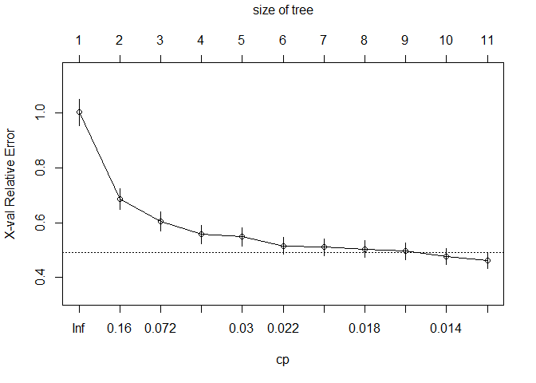

CaRT Demonstration
================
JAS

``` r
knitr::opts_chunk$set(message = FALSE, warning = FALSE)

library(tidyverse)
library(rpart) # construct CaRT
library(caret) # construct CaRT
library(rpart.plot) # makes cleaner looking tree plots
library(pROC) # generate ROC
```

# Demonstration of Classification and Regression Trees (CaRT)

This demonstration of classification and regression trees (CaRT) will
utilize the 2019 County Health Rankings. The rankings provide data on a
number of demographic, social and environmental health characteristics
for counties in the United States. We will be using this dataset to
address two research questions:

1.  What are the predictors of life expectancy on a county-level?

2.  Imagine a scenario where the maintainers of the CHR were concerned
    that the data on firearm fatalities would no longer be made public.
    This information has been used by a number of foundations to target
    population-based interventions at reducing gun violence. They are
    wondering if the counties with higher proportions of firearm
    fatalities would still be able to be identified, based on the other
    data within the CHR. That is, can the other data in the CHR be used
    to classify counties according to having higher or lower
    firearm_fatalities?

The first question will be addressed with a **regression tree**, while
the second will be addressed with a **classification tree**.

------------------------------------------------------------------------

### Load and check data

Variable names in the original dataset were not informative, so we need
to append our own as column names. We also need to strip off the Id
variable for easier processing. We’re also going to look at some basic
descriptives of the data to determine if it needs cleaning, imputation
of missing data, etc.

``` r
chr = read.csv("./Data/chr.csv")

#Stripping off ID Variable
chr = chr[,2:68]

#Assigning informative variable names
var.names = c("pre_death", "poorhealth", "poorphyshealth_days", "poormenthealth_days", "low_bwt", "ad_smoking", "ad_obesity", "foodenv_index", "phys_inactivity", "exer_access", "excess_drink", "alc_drivdeaths", "sti", "teen_birth", "uninsured", "primcareproviders", "dentists", "menthealthproviders", "prevhosp", "mammo_screen", "flu_vacc", "hsgrad", "somecollege", "unemployed", "child_poverty", "income_ineq", "sing_parent", "social_assoc", "violent_crime", "injury_deaths", "pm_air", "water_viol", "housing_prob", "driving_alone", "long_commute", "life_exp", "age_adj_premortality", "freq_physdistress", "freq_mentdistress", "diabetes", "hiv", "food_insecure", "ltd_access_healthyfood", "mvcrash_deaths", "insuff_sleep", "uninsured_adults", "uninsured_child", "other_pcp", "medhhinc", "freelunch_child", "res_seg_bw", "res_seg_nw", "firearm_fatalities", "homeownership", "hous_cost_burden", "population", "bw18", "gte65", "nonhisp_afam", "AmerInd_AlasNative", "Asian", "OPacIslander", "Hisp", "nonhisp_white", "nonprof_english", "female", "rural")

colnames(chr) = var.names

#Stripping off `premature mortality` and `premature death` as they are different metrics of mortality that are highly correlated with life expectancy (they are another measures of life expectancy) 
chr = chr %>% 
  select(-age_adj_premortality, -pre_death)

# The `complete.cases()` function will identify any rows that do not have complete cases (i.e. have missing data)
## This dataset have no missing values
miss.rows = chr[!complete.cases(chr), ] # find rows that is not complete cases

summary(chr)
```

    ##    poorhealth      poorphyshealth_days poormenthealth_days    low_bwt       
    ##  Min.   :0.08289   Min.   :2.324       Min.   :2.440       Min.   :0.02646  
    ##  1st Qu.:0.13948   1st Qu.:3.393       1st Qu.:3.493       1st Qu.:0.06794  
    ##  Median :0.16687   Median :3.869       Median :3.932       Median :0.07877  
    ##  Mean   :0.17468   Mean   :3.920       Mean   :3.932       Mean   :0.08112  
    ##  3rd Qu.:0.20432   3rd Qu.:4.409       3rd Qu.:4.348       3rd Qu.:0.09029  
    ##  Max.   :0.40732   Max.   :7.231       Max.   :5.964       Max.   :0.26136  
    ##    ad_smoking        ad_obesity     foodenv_index    phys_inactivity 
    ##  Min.   :0.06735   Min.   :0.1360   Min.   : 0.000   Min.   :0.0840  
    ##  1st Qu.:0.15234   1st Qu.:0.2930   1st Qu.: 6.900   1st Qu.:0.2220  
    ##  Median :0.17316   Median :0.3230   Median : 7.700   Median :0.2560  
    ##  Mean   :0.17867   Mean   :0.3203   Mean   : 7.465   Mean   :0.2564  
    ##  3rd Qu.:0.20275   3rd Qu.:0.3500   3rd Qu.: 8.200   3rd Qu.:0.2910  
    ##  Max.   :0.42754   Max.   :0.4950   Max.   :10.000   Max.   :0.4510  
    ##   exer_access      excess_drink     alc_drivdeaths        sti        
    ##  Min.   :0.0000   Min.   :0.09265   Min.   :0.0000   Min.   :  40.1  
    ##  1st Qu.:0.4928   1st Qu.:0.15102   1st Qu.:0.2033   1st Qu.: 224.0  
    ##  Median :0.6671   Median :0.17403   Median :0.2857   Median : 336.8  
    ##  Mean   :0.6319   Mean   :0.17431   Mean   :0.2927   Mean   : 385.2  
    ##  3rd Qu.:0.8028   3rd Qu.:0.19678   3rd Qu.:0.3600   3rd Qu.: 469.2  
    ##  Max.   :1.0000   Max.   :0.29440   Max.   :1.0000   Max.   :3543.9  
    ##    teen_birth        uninsured       primcareproviders      dentists        
    ##  Min.   :  2.395   Min.   :0.02068   Min.   :0.0000000   Min.   :0.0000000  
    ##  1st Qu.: 21.339   1st Qu.:0.07156   1st Qu.:0.0003311   1st Qu.:0.0002661  
    ##  Median : 31.432   Median :0.10364   Median :0.0005104   Median :0.0004211  
    ##  Mean   : 31.983   Mean   :0.11108   Mean   :0.0005494   Mean   :0.0004571  
    ##  3rd Qu.: 40.934   3rd Qu.:0.13987   3rd Qu.:0.0007067   3rd Qu.:0.0006041  
    ##  Max.   :110.236   Max.   :0.33454   Max.   :0.0047722   Max.   :0.0072513  
    ##  menthealthproviders    prevhosp      mammo_screen       flu_vacc     
    ##  Min.   :0.0000000   Min.   :  471   Min.   :0.0700   Min.   :0.0300  
    ##  1st Qu.:0.0004945   1st Qu.: 3680   1st Qu.:0.3500   1st Qu.:0.3500  
    ##  Median :0.0011861   Median : 4668   Median :0.4000   Median :0.4200  
    ##  Mean   :0.0015167   Mean   : 4820   Mean   :0.3999   Mean   :0.4055  
    ##  3rd Qu.:0.0019290   3rd Qu.: 5721   3rd Qu.:0.4500   3rd Qu.:0.4800  
    ##  Max.   :0.0200266   Max.   :33333   Max.   :0.6200   Max.   :0.6500  
    ##      hsgrad        somecollege       unemployed      child_poverty   
    ##  Min.   :0.2564   Min.   :0.1676   Min.   :0.01624   Min.   :0.0270  
    ##  1st Qu.:0.8471   1st Qu.:0.4953   1st Qu.:0.03522   1st Qu.:0.1470  
    ##  Median :0.8918   Median :0.5791   Median :0.04362   Median :0.2040  
    ##  Mean   :0.8825   Mean   :0.5774   Mean   :0.04612   Mean   :0.2149  
    ##  3rd Qu.:0.9333   3rd Qu.:0.6622   3rd Qu.:0.05339   3rd Qu.:0.2660  
    ##  Max.   :1.0000   Max.   :0.9367   Max.   :0.20071   Max.   :0.7470  
    ##   income_ineq      sing_parent      social_assoc    violent_crime   
    ##  Min.   : 2.556   Min.   :0.0000   Min.   : 0.000   Min.   :   0.0  
    ##  1st Qu.: 4.018   1st Qu.:0.2569   1st Qu.: 9.337   1st Qu.: 124.4  
    ##  Median : 4.421   Median :0.3183   Median :12.531   Median : 221.2  
    ##  Mean   : 4.519   Mean   :0.3240   Mean   :13.736   Mean   : 254.1  
    ##  3rd Qu.: 4.868   3rd Qu.:0.3773   3rd Qu.:16.427   3rd Qu.: 328.7  
    ##  Max.   :10.100   Max.   :1.0000   Max.   :70.621   Max.   :1819.5  
    ##  injury_deaths        pm_air         water_viol      housing_prob    
    ##  Min.   : 25.59   Min.   : 3.000   Min.   :0.0000   Min.   :0.03038  
    ##  1st Qu.: 68.98   1st Qu.: 7.700   1st Qu.:0.0000   1st Qu.:0.11340  
    ##  Median : 82.21   Median : 9.300   Median :0.0000   Median :0.13846  
    ##  Mean   : 84.80   Mean   : 9.011   Mean   :0.3867   Mean   :0.14276  
    ##  3rd Qu.: 96.41   3rd Qu.:10.400   3rd Qu.:1.0000   3rd Qu.:0.16461  
    ##  Max.   :284.96   Max.   :19.700   Max.   :1.0000   Max.   :0.71217  
    ##  driving_alone      long_commute       life_exp     freq_physdistress
    ##  Min.   :0.04585   Min.   :0.0000   Min.   :62.44   Min.   :0.06937  
    ##  1st Qu.:0.77180   1st Qu.:0.2160   1st Qu.:75.59   1st Qu.:0.10205  
    ##  Median :0.80944   Median :0.3050   Median :77.48   Median :0.11714  
    ##  Mean   :0.79489   Mean   :0.3096   Mean   :77.46   Mean   :0.11984  
    ##  3rd Qu.:0.83953   3rd Qu.:0.3940   3rd Qu.:79.27   3rd Qu.:0.13527  
    ##  Max.   :0.97207   Max.   :0.8450   Max.   :97.97   Max.   :0.24618  
    ##  freq_mentdistress    diabetes          hiv         food_insecure   
    ##  Min.   :0.08035   Min.   :0.033   Min.   :  10.4   Min.   :0.0370  
    ##  1st Qu.:0.10793   1st Qu.:0.097   1st Qu.:  85.2   1st Qu.:0.1100  
    ##  Median :0.12090   Median :0.114   Median : 173.4   Median :0.1310  
    ##  Mean   :0.12209   Mean   :0.116   Mean   : 190.8   Mean   :0.1369  
    ##  3rd Qu.:0.13463   3rd Qu.:0.133   3rd Qu.: 190.8   3rd Qu.:0.1570  
    ##  Max.   :0.22206   Max.   :0.209   Max.   :2590.2   Max.   :0.3610  
    ##  ltd_access_healthyfood mvcrash_deaths    insuff_sleep    uninsured_adults 
    ##  Min.   :0.00000        Min.   : 2.807   Min.   :0.2303   Min.   :0.02543  
    ##  1st Qu.:0.03652        1st Qu.:12.758   1st Qu.:0.3004   1st Qu.:0.08259  
    ##  Median :0.06559        Median :18.843   Median :0.3299   Median :0.12309  
    ##  Mean   :0.08615        Mean   :18.843   Mean   :0.3306   Mean   :0.13253  
    ##  3rd Qu.:0.10583        3rd Qu.:22.543   3rd Qu.:0.3613   3rd Qu.:0.17021  
    ##  Max.   :0.71844        Max.   :92.162   Max.   :0.4671   Max.   :0.40679  
    ##  uninsured_child      other_pcp            medhhinc      freelunch_child 
    ##  Min.   :0.007647   Min.   :0.0000000   Min.   : 22679   Min.   :0.0000  
    ##  1st Qu.:0.036064   1st Qu.:0.0004475   1st Qu.: 42437   1st Qu.:0.4146  
    ##  Median :0.050010   Median :0.0006747   Median : 49070   Median :0.5269  
    ##  Mean   :0.058402   Mean   :0.0007743   Mean   : 51237   Mean   :0.5347  
    ##  3rd Qu.:0.072005   3rd Qu.:0.0009653   3rd Qu.: 56965   3rd Qu.:0.6304  
    ##  Max.   :0.232258   Max.   :0.0143389   Max.   :136191   Max.   :1.0000  
    ##    res_seg_bw        res_seg_nw       firearm_fatalities homeownership    
    ##  Min.   : 0.6328   Min.   : 0.04508   Min.   : 1.7       Min.   :0.03774  
    ##  1st Qu.:40.8522   1st Qu.:23.67956   1st Qu.:12.1       1st Qu.:0.67354  
    ##  Median :45.7702   Median :31.28347   Median :15.1       Median :0.72456  
    ##  Mean   :45.7702   Mean   :31.28347   Mean   :15.1       Mean   :0.71244  
    ##  3rd Qu.:51.3547   3rd Qu.:38.15045   3rd Qu.:16.6       3rd Qu.:0.76826  
    ##  Max.   :91.1238   Max.   :91.09909   Max.   :76.8       Max.   :0.93452  
    ##  hous_cost_burden    population            bw18            gte65        
    ##  Min.   :0.00463   Min.   :      88   Min.   :0.0000   Min.   :0.04767  
    ##  1st Qu.:0.09048   1st Qu.:   11134   1st Qu.:0.2021   1st Qu.:0.15813  
    ##  Median :0.11096   Median :   26484   Median :0.2223   Median :0.18386  
    ##  Mean   :0.11534   Mean   :  204021   Mean   :0.2224   Mean   :0.18768  
    ##  3rd Qu.:0.13548   3rd Qu.:   72564   3rd Qu.:0.2399   3rd Qu.:0.21224  
    ##  Max.   :0.31641   Max.   :39536653   Max.   :0.4124   Max.   :0.56944  
    ##   nonhisp_afam      AmerInd_AlasNative     Asian           OPacIslander      
    ##  Min.   :0.000000   Min.   :0.000000   Min.   :0.000000   Min.   :0.0000000  
    ##  1st Qu.:0.006941   1st Qu.:0.003731   1st Qu.:0.004507   1st Qu.:0.0003040  
    ##  Median :0.022409   Median :0.006340   Median :0.007159   Median :0.0005972  
    ##  Mean   :0.090019   Mean   :0.023246   Mean   :0.015739   Mean   :0.0014095  
    ##  3rd Qu.:0.102937   3rd Qu.:0.013103   3rd Qu.:0.014429   3rd Qu.:0.0011427  
    ##  Max.   :0.853296   Max.   :0.926969   Max.   :0.430067   Max.   :0.4772727  
    ##       Hisp          nonhisp_white    nonprof_english        female      
    ##  Min.   :0.005151   Min.   :0.0276   Min.   :0.000000   Min.   :0.2657  
    ##  1st Qu.:0.023124   1st Qu.:0.6428   1st Qu.:0.002801   1st Qu.:0.4942  
    ##  Median :0.043213   Median :0.8346   Median :0.007502   Median :0.5032  
    ##  Mean   :0.095168   Mean   :0.7616   Mean   :0.017475   Mean   :0.4990  
    ##  3rd Qu.:0.098455   3rd Qu.:0.9247   3rd Qu.:0.018927   3rd Qu.:0.5103  
    ##  Max.   :0.963230   Max.   :0.9792   Max.   :0.353053   Max.   :0.5700  
    ##      rural       
    ##  Min.   :0.0000  
    ##  1st Qu.:0.3260  
    ##  Median :0.5876  
    ##  Mean   :0.5806  
    ##  3rd Qu.:0.8590  
    ##  Max.   :1.0000

``` r
#variables have very different distributions, but tree-based methods do not require scaling.

#Create the variable for Part 2, an indicator of having fire-arm fatalities above the median
chr$firearm.class = as.factor(ifelse(chr$firearm_fatalities > median(chr$firearm_fatalities), 1, 0))
summary(chr$firearm.class)
```

    ##    0    1 
    ## 2210  983

``` r
#Note that data are slightly unbalanced.
```

### Partition data into training and testing sets.

``` r
set.seed(123)

#To address Question 1 
training.data.q1 = 
  chr$life_exp %>% 
  createDataPartition(p = 0.7, list = F)

train.data.q1 = chr[training.data.q1, ]
test.data.q1 = chr[-training.data.q1, ]

#Remove firearm.class variable as its only used for Question 2 by base R method
train.data.q1$firearm.class = NULL
test.data.q1$firearm.class = NULL

#To address Question 2
training.data.q2 = 
  chr$firearm.class %>% 
  createDataPartition(p = 0.7, list = F)

train.data.q2 = chr[training.data.q2, ]
test.data.q2 = chr[-training.data.q2, ]

#Remove firearm fatalities variable as it was used to create our new outcome variable
train.data.q2$firearm_fatalities<-NULL
test.data.q2$firearm_fatalities<-NULL
```

## PART 1: REGRESSION TREES

We will create a number of regression trees to predict life expectancy.
`Caret` calls to `rpart` (meaning `rpart` belongs to `Caret`), but
doesn’t have the same level of hyperparameter turning as `rpart`. In
`caret`, you can only change the **complexity parameter** (**cp**). In
addition, `caret` automatically performs pruning (whereas in `rpart`
you, by default, can see the full tree.)

From within `caret`, you can still visualize the tree and get measures
of variable importance.

Variable Importance: “An overall measure of variable importance is the
sum of the goodness of split measures for each split for which it was
the primary variable.”

``` r
# Check what `rpart` can do
modelLookup("rpart")
```

    ##   model parameter                label forReg forClass probModel
    ## 1 rpart        cp Complexity Parameter   TRUE     TRUE      TRUE

``` r
set.seed(123)

#Using 10-fold cross-validation to train model
train.control = trainControl(method = "cv", number = 10)

#Using rpart method to generate regression tree, using all variables in dataset to predict life expectancy
tree.lifexp.1 = train(life_exp ~ . , data = train.data.q1, method = "rpart", trControl = train.control)

tree.lifexp.1$bestTune
```

    ##           cp
    ## 1 0.07121066

``` r
tree.lifexp.1$results
```

    ##           cp     RMSE  Rsquared      MAE    RMSESD RsquaredSD     MAESD
    ## 1 0.07121066 2.331187 0.3919349 1.713118 0.2925983 0.07196497 0.1343429
    ## 2 0.07317617 2.356872 0.3800458 1.732158 0.3023548 0.06336335 0.1323991
    ## 3 0.33400015 2.730567 0.3089629 2.055688 0.3725591 0.03899337 0.2553687

``` r
# Note that it only run 3 cp values, so we might want to explore more cp values manually.

#Can use `rpart.plot` function to visualize tree
rpart.plot(tree.lifexp.1$finalModel)
```

<!-- -->

##### How to visualize the regression tree?

At the top of the tree, the average life expectancy is 77 (100% data in
this node). When we split at *teen_birth*, \* if a place has higher
teen_birth rate (\>= 33 (yes)), the average life expectancy is 75 (there
are 43% of data in this node); \* if a place has lower teen_birth rate
(\>= 33 (no)), the average life expectancy is 79 (57% of data are in
this node).

Following the lower teen birth rate node, it split again at *diabetes*,
\* if a county diabetes prevalence is higher than 10% (\>= 0.1 (yes)),
the average life expectancy is 78 (32% of data in this node); \* if a
county diabetes prevalence is lower than 10% (\>= 0.1 (no)), the average
life expectancy is 80 (25% of data in this node)

### Apply baseline model in test set

If we are satisfied with this tree, we can go ahead and apply this model
to the test set to generate predictions and construct evaluation
metrics.

``` r
#First create predictions
pred.intest.temp = predict(tree.lifexp.1, newdata = test.data.q1)

#Then use postResample to obtain evaluation metrics
## We use postResample for continuous outcome
postResample(pred.intest.temp, test.data.q1$life_exp)
```

    ##      RMSE  Rsquared       MAE 
    ## 2.2300584 0.3979212 1.6579348

Based on the evaluation metrics, we can see that the RMSE is 2.23, and
the $R^2$ is only about 0.40. Remember, we were using the baseline
(“default”) cp-values computed by the computer to obtain the results we
see above. So maybe we would want to tune our hyperparameter (the cp)?

### Tuning hyperparameter (the complexity parameter)

We want to specify `tuneGrid` so `Caret` explores wider variety of cp
values.

``` r
set.seed(123)

#Create different values of cp to try
cp.grid = expand.grid(cp = seq(0.001, 0.1, by = 0.001))

tree.lifexp.2 = train(life_exp ~ ., data = train.data.q1, method = "rpart", trControl = train.control, tuneGrid = cp.grid)
# Notice this time we add a "tuneGrid = " to specify that we want to try our own cp values.

# Check the optimal cp value
tree.lifexp.2$bestTune
```

    ##      cp
    ## 6 0.006

``` r
tree.lifexp.2$results
```

    ##        cp     RMSE  Rsquared      MAE    RMSESD RsquaredSD      MAESD
    ## 1   0.001 1.954976 0.5903592 1.387472 0.2858021 0.06196666 0.16377427
    ## 2   0.002 1.943867 0.5892636 1.386871 0.2687783 0.05554761 0.14608508
    ## 3   0.003 1.942567 0.5880975 1.389301 0.2431406 0.04478879 0.12707542
    ## 4   0.004 1.943166 0.5858922 1.396050 0.2382060 0.04262715 0.12272741
    ## 5   0.005 1.921419 0.5934894 1.387063 0.2506999 0.04530220 0.12547414
    ## 6   0.006 1.916509 0.5942266 1.390985 0.2452330 0.04632273 0.12109128
    ## 7   0.007 1.948538 0.5789713 1.422596 0.2302686 0.04597117 0.10695395
    ## 8   0.008 1.980607 0.5668536 1.439279 0.2549752 0.05364234 0.10510739
    ## 9   0.009 1.986723 0.5635495 1.446240 0.2453146 0.05226461 0.10322023
    ## 10  0.010 1.989792 0.5623322 1.452640 0.2461964 0.05104500 0.10263109
    ## 11  0.011 1.997644 0.5593396 1.455193 0.2564495 0.05686649 0.10061066
    ## 12  0.012 1.996828 0.5597793 1.457786 0.2582145 0.05916545 0.10269376
    ## 13  0.013 1.996959 0.5597454 1.458802 0.2585595 0.05925568 0.10483584
    ## 14  0.014 1.996959 0.5597454 1.458802 0.2585595 0.05925568 0.10483584
    ## 15  0.015 2.019771 0.5502394 1.471363 0.2570262 0.05270296 0.09855789
    ## 16  0.016 2.051693 0.5356220 1.495174 0.2387264 0.04792732 0.09058937
    ## 17  0.017 2.074799 0.5252565 1.518025 0.2371796 0.04713274 0.09961299
    ## 18  0.018 2.106277 0.5096943 1.542901 0.2568059 0.05425587 0.09874356
    ## 19  0.019 2.133388 0.4962631 1.558835 0.2751362 0.05706271 0.11708537
    ## 20  0.020 2.139307 0.4934273 1.563417 0.2714813 0.05507320 0.10928908
    ## 21  0.021 2.139307 0.4934273 1.563417 0.2714813 0.05507320 0.10928908
    ## 22  0.022 2.138489 0.4934384 1.563544 0.2745702 0.05579502 0.11418662
    ## 23  0.023 2.138489 0.4934384 1.563544 0.2745702 0.05579502 0.11418662
    ## 24  0.024 2.138489 0.4934384 1.563544 0.2745702 0.05579502 0.11418662
    ## 25  0.025 2.150122 0.4882945 1.568021 0.2821709 0.04893183 0.11414948
    ## 26  0.026 2.150122 0.4882945 1.568021 0.2821709 0.04893183 0.11414948
    ## 27  0.027 2.150122 0.4882945 1.568021 0.2821709 0.04893183 0.11414948
    ## 28  0.028 2.150122 0.4882945 1.568021 0.2821709 0.04893183 0.11414948
    ## 29  0.029 2.163127 0.4817728 1.581525 0.2770044 0.05120478 0.11674277
    ## 30  0.030 2.169077 0.4777127 1.590562 0.2778432 0.05310547 0.11016265
    ## 31  0.031 2.178078 0.4736450 1.597149 0.2776084 0.05096556 0.10913896
    ## 32  0.032 2.186881 0.4684130 1.601268 0.2860987 0.04727450 0.10946395
    ## 33  0.033 2.189077 0.4665406 1.607773 0.2808062 0.04449092 0.10432624
    ## 34  0.034 2.183233 0.4689638 1.604730 0.2861766 0.04622403 0.10659099
    ## 35  0.035 2.185158 0.4679979 1.607937 0.2868856 0.04666018 0.10874969
    ## 36  0.036 2.185158 0.4679979 1.607937 0.2868856 0.04666018 0.10874969
    ## 37  0.037 2.185158 0.4679979 1.607937 0.2868856 0.04666018 0.10874969
    ## 38  0.038 2.186156 0.4674248 1.610979 0.2889350 0.04797686 0.11335595
    ## 39  0.039 2.186156 0.4674248 1.610979 0.2889350 0.04797686 0.11335595
    ## 40  0.040 2.186156 0.4674248 1.610979 0.2889350 0.04797686 0.11335595
    ## 41  0.041 2.186156 0.4674248 1.610979 0.2889350 0.04797686 0.11335595
    ## 42  0.042 2.186156 0.4674248 1.610979 0.2889350 0.04797686 0.11335595
    ## 43  0.043 2.186156 0.4674248 1.610979 0.2889350 0.04797686 0.11335595
    ## 44  0.044 2.186156 0.4674248 1.610979 0.2889350 0.04797686 0.11335595
    ## 45  0.045 2.186156 0.4674248 1.610979 0.2889350 0.04797686 0.11335595
    ## 46  0.046 2.186156 0.4674248 1.610979 0.2889350 0.04797686 0.11335595
    ## 47  0.047 2.186156 0.4674248 1.610979 0.2889350 0.04797686 0.11335595
    ## 48  0.048 2.186156 0.4674248 1.610979 0.2889350 0.04797686 0.11335595
    ## 49  0.049 2.186156 0.4674248 1.610979 0.2889350 0.04797686 0.11335595
    ## 50  0.050 2.186156 0.4674248 1.610979 0.2889350 0.04797686 0.11335595
    ## 51  0.051 2.186156 0.4674248 1.610979 0.2889350 0.04797686 0.11335595
    ## 52  0.052 2.186156 0.4674248 1.610979 0.2889350 0.04797686 0.11335595
    ## 53  0.053 2.186156 0.4674248 1.610979 0.2889350 0.04797686 0.11335595
    ## 54  0.054 2.186156 0.4674248 1.610979 0.2889350 0.04797686 0.11335595
    ## 55  0.055 2.186156 0.4674248 1.610979 0.2889350 0.04797686 0.11335595
    ## 56  0.056 2.186156 0.4674248 1.610979 0.2889350 0.04797686 0.11335595
    ## 57  0.057 2.186156 0.4674248 1.610979 0.2889350 0.04797686 0.11335595
    ## 58  0.058 2.186156 0.4674248 1.610979 0.2889350 0.04797686 0.11335595
    ## 59  0.059 2.186156 0.4674248 1.610979 0.2889350 0.04797686 0.11335595
    ## 60  0.060 2.186156 0.4674248 1.610979 0.2889350 0.04797686 0.11335595
    ## 61  0.061 2.186156 0.4674248 1.610979 0.2889350 0.04797686 0.11335595
    ## 62  0.062 2.186156 0.4674248 1.610979 0.2889350 0.04797686 0.11335595
    ## 63  0.063 2.186156 0.4674248 1.610979 0.2889350 0.04797686 0.11335595
    ## 64  0.064 2.186156 0.4674248 1.610979 0.2889350 0.04797686 0.11335595
    ## 65  0.065 2.186156 0.4674248 1.610979 0.2889350 0.04797686 0.11335595
    ## 66  0.066 2.203825 0.4579700 1.624518 0.2675717 0.03902045 0.09793458
    ## 67  0.067 2.224956 0.4467356 1.638387 0.2510059 0.04645024 0.09298049
    ## 68  0.068 2.224956 0.4467356 1.638387 0.2510059 0.04645024 0.09298049
    ## 69  0.069 2.262750 0.4281135 1.663938 0.2733202 0.05171660 0.11327201
    ## 70  0.070 2.304357 0.4066184 1.693985 0.2711584 0.05310449 0.11057841
    ## 71  0.071 2.331187 0.3919349 1.713118 0.2925983 0.07196497 0.13434287
    ## 72  0.072 2.331187 0.3919349 1.713118 0.2925983 0.07196497 0.13434287
    ## 73  0.073 2.356872 0.3800458 1.732158 0.3023548 0.06336335 0.13239906
    ## 74  0.074 2.368860 0.3740969 1.743440 0.3130686 0.06619961 0.14578055
    ## 75  0.075 2.375010 0.3704626 1.749329 0.3067059 0.06141214 0.13792942
    ## 76  0.076 2.428666 0.3423241 1.785426 0.2964255 0.04267214 0.12547544
    ## 77  0.077 2.433388 0.3378676 1.785545 0.2916016 0.04169003 0.12535449
    ## 78  0.078 2.433388 0.3378676 1.785545 0.2916016 0.04169003 0.12535449
    ## 79  0.079 2.438854 0.3345337 1.790029 0.2881636 0.03887959 0.12308516
    ## 80  0.080 2.438854 0.3345337 1.790029 0.2881636 0.03887959 0.12308516
    ## 81  0.081 2.438854 0.3345337 1.790029 0.2881636 0.03887959 0.12308516
    ## 82  0.082 2.438854 0.3345337 1.790029 0.2881636 0.03887959 0.12308516
    ## 83  0.083 2.438854 0.3345337 1.790029 0.2881636 0.03887959 0.12308516
    ## 84  0.084 2.438854 0.3345337 1.790029 0.2881636 0.03887959 0.12308516
    ## 85  0.085 2.438854 0.3345337 1.790029 0.2881636 0.03887959 0.12308516
    ## 86  0.086 2.438854 0.3345337 1.790029 0.2881636 0.03887959 0.12308516
    ## 87  0.087 2.438854 0.3345337 1.790029 0.2881636 0.03887959 0.12308516
    ## 88  0.088 2.438854 0.3345337 1.790029 0.2881636 0.03887959 0.12308516
    ## 89  0.089 2.438854 0.3345337 1.790029 0.2881636 0.03887959 0.12308516
    ## 90  0.090 2.438854 0.3345337 1.790029 0.2881636 0.03887959 0.12308516
    ## 91  0.091 2.438854 0.3345337 1.790029 0.2881636 0.03887959 0.12308516
    ## 92  0.092 2.438854 0.3345337 1.790029 0.2881636 0.03887959 0.12308516
    ## 93  0.093 2.438854 0.3345337 1.790029 0.2881636 0.03887959 0.12308516
    ## 94  0.094 2.438854 0.3345337 1.790029 0.2881636 0.03887959 0.12308516
    ## 95  0.095 2.438854 0.3345337 1.790029 0.2881636 0.03887959 0.12308516
    ## 96  0.096 2.438854 0.3345337 1.790029 0.2881636 0.03887959 0.12308516
    ## 97  0.097 2.438854 0.3345337 1.790029 0.2881636 0.03887959 0.12308516
    ## 98  0.098 2.438854 0.3345337 1.790029 0.2881636 0.03887959 0.12308516
    ## 99  0.099 2.438854 0.3345337 1.790029 0.2881636 0.03887959 0.12308516
    ## 100 0.100 2.438854 0.3345337 1.790029 0.2881636 0.03887959 0.12308516

``` r
#Plot new "best" tree
rpart.plot(tree.lifexp.2$finalModel)
```

<!-- -->

Note that we have a new best cp, and the tree plot is much more
complicated that the baseline one. The tree is too small to look at. We
can have other ways to look at variable importance.

### Apply tuned model to test set

``` r
pred.intest.2 = predict(tree.lifexp.2, newdata = test.data.q1)

#Then use postResample to obtain evaluation metrics
postResample(pred.intest.2, test.data.q1$life_exp)
```

    ##      RMSE  Rsquared       MAE 
    ## 1.8564915 0.5897789 1.3280170

Based on the evaluation metrics, the new model gives us smaller RMSE
value (1.86) and a greater $R^2$ (0.59).

### Explore variable importance in final model

We will use the `varImp` function to explore variable importance. It
will rank each variable in terms of importance and scale them.

``` r
varImp(tree.lifexp.2)
```

    ## rpart variable importance
    ## 
    ##   only 20 most important variables shown (out of 64)
    ## 
    ##                     Overall
    ## ad_smoking           100.00
    ## injury_deaths         90.15
    ## teen_birth            76.86
    ## freq_mentdistress     74.66
    ## poorhealth            68.38
    ## diabetes              61.09
    ## freq_physdistress     49.78
    ## food_insecure         46.35
    ## child_poverty         38.06
    ## phys_inactivity       33.16
    ## prevhosp              27.70
    ## pm_air                25.46
    ## nonprof_english       24.95
    ## AmerInd_AlasNative    21.41
    ## Hisp                  20.34
    ## poormenthealth_days   18.70
    ## ad_obesity            17.54
    ## medhhinc              15.62
    ## low_bwt               15.36
    ## income_ineq           14.55

We can see that `ad_smoking` is the number 1 most important predictor
for predicting life expectancy in this dataset, followed by
`injury_deaths` and then `teen_birth`. Remember in the baseline model,
the tree first split at `teen_birth`…

### Unpruned tree

Using `rpart` without `Caret`, we will get an unpruned tree.

``` r
# We will use "ANOVA" because this is a regression tree.
tree.lifexp.3 = rpart(life_exp ~ ., data = train.data.q1, method = "anova")

# Check the cp it has been trying (default number of cp is 10)
printcp(tree.lifexp.3)
```

    ## 
    ## Regression tree:
    ## rpart(formula = life_exp ~ ., data = train.data.q1, method = "anova")
    ## 
    ## Variables actually used in tree construction:
    ## [1] ad_obesity    ad_smoking    diabetes      food_insecure injury_deaths
    ## [6] poorhealth    prevhosp      teen_birth   
    ## 
    ## Root node error: 20023/2237 = 8.951
    ## 
    ## n= 2237 
    ## 
    ##          CP nsplit rel error  xerror     xstd
    ## 1  0.334000      0   1.00000 1.00066 0.047669
    ## 2  0.073176      1   0.66600 0.68478 0.038237
    ## 3  0.071211      2   0.59282 0.60504 0.035158
    ## 4  0.031620      3   0.52161 0.55773 0.033553
    ## 5  0.027974      4   0.48999 0.54842 0.033301
    ## 6  0.017993      5   0.46202 0.51540 0.030763
    ## 7  0.017934      6   0.44403 0.51042 0.030621
    ## 8  0.017431      7   0.42609 0.50385 0.030507
    ## 9  0.016887      8   0.40866 0.49591 0.030299
    ## 10 0.012022      9   0.39177 0.47660 0.029824
    ## 11 0.010000     10   0.37975 0.46264 0.028990

``` r
# Plot to see how the best tuned cp is selected
plotcp(tree.lifexp.3)
```

<!-- -->

``` r
# print out the tree but this is hard to visualize
print(tree.lifexp.3)
```

    ## n= 2237 
    ## 
    ## node), split, n, deviance, yval
    ##       * denotes terminal node
    ## 
    ##  1) root 2237 20023.44000 77.47202  
    ##    2) teen_birth>=32.51939 955  5966.32300 75.46869  
    ##      4) ad_smoking>=0.1887231 602  2817.88900 74.53301  
    ##        8) injury_deaths>=95.449 263  1210.61200 73.36868  
    ##         16) ad_smoking>=0.2480356 51   319.78930 70.98630 *
    ##         17) ad_smoking< 0.2480356 212   531.72340 73.94180 *
    ##        9) injury_deaths< 95.449 339   974.13340 75.43631 *
    ##      5) ad_smoking< 0.1887231 353  1722.55200 77.06439  
    ##       10) food_insecure>=0.1045 287   951.70970 76.57993 *
    ##       11) food_insecure< 0.1045 66   410.56410 79.17108 *
    ##    3) teen_birth< 32.51939 1282  7369.28200 78.96436  
    ##      6) diabetes>=0.1015 724  2636.26400 78.02581  
    ##       12) poorhealth>=0.1641845 256   827.64600 77.08703 *
    ##       13) poorhealth< 0.1641845 468  1459.59200 78.53933 *
    ##      7) diabetes< 0.1015 558  3267.78000 80.18212  
    ##       14) ad_obesity>=0.1985 532  2219.02700 79.96063  
    ##         28) injury_deaths>=65.12574 338  1168.92800 79.35664 *
    ##         29) injury_deaths< 65.12574 194   711.97060 81.01293 *
    ##       15) ad_obesity< 0.1985 26   488.60940 84.71424  
    ##         30) prevhosp>=1835 19    45.66227 82.86731 *
    ##         31) prevhosp< 1835 7   202.21790 89.72733 *

``` r
# Better to visualize the tree using `rpart.plot`
rpart.plot(tree.lifexp.3)
```

<!-- -->

------------------------------------------------------------------------

## PART 2: CLASSIFICATION TREES

``` r
set.seed(123)

#Creating 10-fold cross-validation and using down-sampling because of imbalance in data
train.control.class = trainControl(method = "cv", number = 10, sampling = "down")

#Create sequence of cp parameters to try 
grid.2 = expand.grid(cp = seq(0.001, 0.3, by = 0.01))

#Train model
tree.firearm = train(firearm.class ~ ., data = train.data.q2, method = "rpart", trControl = train.control.class, tuneGrid = grid.2)

# Find best tune cp
tree.firearm
```

    ## CART 
    ## 
    ## 2236 samples
    ##   64 predictor
    ##    2 classes: '0', '1' 
    ## 
    ## No pre-processing
    ## Resampling: Cross-Validated (10 fold) 
    ## Summary of sample sizes: 2012, 2012, 2012, 2013, 2012, 2013, ... 
    ## Addtional sampling using down-sampling
    ## 
    ## Resampling results across tuning parameters:
    ## 
    ##   cp     Accuracy   Kappa    
    ##   0.001  0.7347843  0.4318731
    ##   0.011  0.7661106  0.5157751
    ##   0.021  0.7531381  0.4940759
    ##   0.031  0.7486497  0.4766109
    ##   0.041  0.7607253  0.4706990
    ##   0.051  0.7442075  0.4448374
    ##   0.061  0.7236175  0.4123681
    ##   0.071  0.7195997  0.4054893
    ##   0.081  0.7195997  0.4054893
    ##   0.091  0.7195997  0.4054893
    ##   0.101  0.7195997  0.4054893
    ##   0.111  0.7195997  0.4054893
    ##   0.121  0.7195997  0.4054893
    ##   0.131  0.7195997  0.4054893
    ##   0.141  0.7195997  0.4054893
    ##   0.151  0.7195997  0.4054893
    ##   0.161  0.7195997  0.4054893
    ##   0.171  0.7195997  0.4054893
    ##   0.181  0.7195997  0.4054893
    ##   0.191  0.7195997  0.4054893
    ##   0.201  0.7195997  0.4054893
    ##   0.211  0.7195997  0.4054893
    ##   0.221  0.7195997  0.4054893
    ##   0.231  0.7195997  0.4054893
    ##   0.241  0.7195997  0.4054893
    ##   0.251  0.7195997  0.4054893
    ##   0.261  0.7195997  0.4054893
    ##   0.271  0.7195997  0.4054893
    ##   0.281  0.7195997  0.4054893
    ##   0.291  0.7195997  0.4054893
    ## 
    ## Accuracy was used to select the optimal model using the largest value.
    ## The final value used for the model was cp = 0.011.

``` r
tree.firearm$bestTune
```

    ##      cp
    ## 2 0.011

Note that the accuracy of cp = 0.011 is 0.766, while the accuracy of cp
= 0.041 is 0.761. They have very close accuracy, so maybe we could
compare these two trees (using these two cp values) because a larger cp
value will give us a simpler tree. **When interpretability is an issue
we might want to look at that**.

Visualize the tree.

``` r
rpart.plot(tree.firearm$finalModel)
```

<!-- -->

##### How to visualize the classification tree?

A green node indicates it has the majority of the data; a blue node
means it has less proportion of data. In this tree, the root node is a
very light blue because the data is split at 50-50. The first number
indicates the major class (0 or 1). The second number in the node
indicates the proportion of target class in the node. For example, in
the root node, it shows 0.50, meaning 50% of the data in the root node
is the target class (target class is usually the outcome (1) = higher
firearm fatalities). The third number shows the percentage of data in
the node. The root node has 100% of the data.

The 1st split is at the life expectancy. \* Counties that have higher
life expectancy (\>= 77 (yes)), the firearm fatalities ????????? Need
clarification

### Run variable importance

``` r
#Obtain variable importance on the final model within training data
varImp(tree.firearm)
```

    ## rpart variable importance
    ## 
    ##   only 20 most important variables shown (out of 64)
    ## 
    ##                     Overall
    ## poorphyshealth_days 100.000
    ## life_exp             95.024
    ## food_insecure        84.529
    ## freq_mentdistress    73.771
    ## teen_birth           70.553
    ## population           49.572
    ## uninsured            44.874
    ## uninsured_adults     42.812
    ## injury_deaths        39.920
    ## freq_physdistress    26.429
    ## child_poverty        17.983
    ## uninsured_child      14.561
    ## low_bwt              13.788
    ## AmerInd_AlasNative   13.514
    ## poormenthealth_days  12.424
    ## social_assoc         11.422
    ## phys_inactivity      10.305
    ## pm_air                7.408
    ## income_ineq           5.267
    ## excess_drink          4.071

``` r
#Note you can get accuracy metric and confusion matrix from training.
confusionMatrix(tree.firearm) # this gives us average accuracy across all 10 folds.
```

    ## Cross-Validated (10 fold) Confusion Matrix 
    ## 
    ## (entries are percentual average cell counts across resamples)
    ##  
    ##           Reference
    ## Prediction    0    1
    ##          0 50.2  4.4
    ##          1 19.0 26.4
    ##                             
    ##  Accuracy (average) : 0.7661

### Apply model to test set

If we are satisfied with this model, we can then apply it to our test
set.

``` r
# Option 1
## Create predictions in test set (predict whether a county will have high or low firearm fatalities)
pred.firearm = predict(tree.firearm, test.data.q2)

# Option 2
## Create predictions as probabilities on test set (obtain probabilities when we want to get propensity score or when we are interested in getting a risk score) 
pred.firearm.prob = predict(tree.firearm, test.data.q2, type = "prob")

# Save the evaluation results
eval.results = confusionMatrix(pred.firearm, test.data.q2$firearm.class, positive = "1")
print(eval.results)
```

    ## Confusion Matrix and Statistics
    ## 
    ##           Reference
    ## Prediction   0   1
    ##          0 473  34
    ##          1 190 260
    ##                                           
    ##                Accuracy : 0.7659          
    ##                  95% CI : (0.7378, 0.7924)
    ##     No Information Rate : 0.6928          
    ##     P-Value [Acc > NIR] : 3.026e-07       
    ##                                           
    ##                   Kappa : 0.5209          
    ##                                           
    ##  Mcnemar's Test P-Value : < 2.2e-16       
    ##                                           
    ##             Sensitivity : 0.8844          
    ##             Specificity : 0.7134          
    ##          Pos Pred Value : 0.5778          
    ##          Neg Pred Value : 0.9329          
    ##              Prevalence : 0.3072          
    ##          Detection Rate : 0.2717          
    ##    Detection Prevalence : 0.4702          
    ##       Balanced Accuracy : 0.7989          
    ##                                           
    ##        'Positive' Class : 1               
    ## 

``` r
#Another potential evaluation: Area under the Receiver Operating Curve (AUROC)
analysis = roc(response = test.data.q2$firearm.class, predictor = pred.firearm.prob[,2])

plot(1-analysis$specificities, analysis$sensitivities, type="l",
  ylab = "Sensitivity", xlab = "1-Specificity", col="black", lwd = 2,
  main = "ROC Curve for Greater Firearm Fatalities")
abline(a = 0, b = 1)
```

<!-- -->
