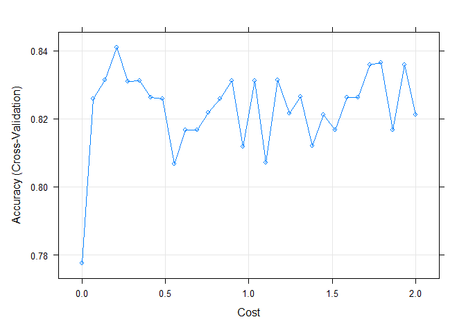
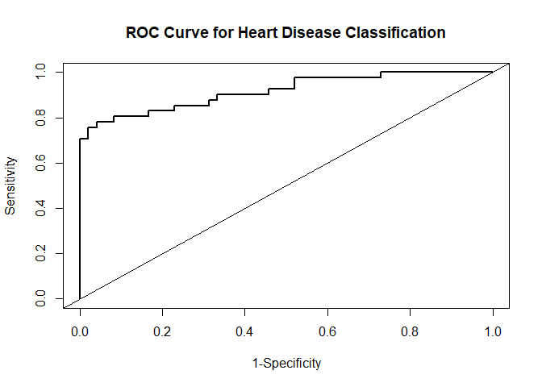

SVM Demonstration
================
JAS

``` r
knitr::opts_chunk$set(message = FALSE, warning = FALSE)

library(tidyverse)
library(caret)
library(e1071) # SVM 
library(kernlab) #???
library(pROC) # generate ROC
```

# Demonstration of Support Vector Classifiers

Data Citation: We are using a dataset containing features related to
heart disease. There are 13 features and the outcome variable is a
binary, classification variable indicating the presence of heart
disease.

------------------------------------------------------------------------

### Load data and perform minor cleaning, check and recode missings etc.

1.  How to load a flat text file
2.  How to assign column names when none are provided
3.  How to check variable types across the dataframe
4.  How to recode missing indicators, change variable types and explore
    variable distributions

``` r
# Read in dataset
heart.data = read.csv("./Data/processed.cleveland.data", header = FALSE)

# Create informative variable names
var.names = c("age", "sex", "pain_type", "resting_sysbp", "chol", "fast_blsugar_gt120", "rest_ecg", "max_hr", "exerc_angina", "ST_depression", "ST_slope", "vessels_colorflu", "defect", "heart_disease_present")

# Assign variable names to each column
colnames(heart.data) = var.names

# Check variable types
str(heart.data)
```

    ## 'data.frame':    303 obs. of  14 variables:
    ##  $ age                  : num  63 67 67 37 41 56 62 57 63 53 ...
    ##  $ sex                  : num  1 1 1 1 0 1 0 0 1 1 ...
    ##  $ pain_type            : num  1 4 4 3 2 2 4 4 4 4 ...
    ##  $ resting_sysbp        : num  145 160 120 130 130 120 140 120 130 140 ...
    ##  $ chol                 : num  233 286 229 250 204 236 268 354 254 203 ...
    ##  $ fast_blsugar_gt120   : num  1 0 0 0 0 0 0 0 0 1 ...
    ##  $ rest_ecg             : num  2 2 2 0 2 0 2 0 2 2 ...
    ##  $ max_hr               : num  150 108 129 187 172 178 160 163 147 155 ...
    ##  $ exerc_angina         : num  0 1 1 0 0 0 0 1 0 1 ...
    ##  $ ST_depression        : num  2.3 1.5 2.6 3.5 1.4 0.8 3.6 0.6 1.4 3.1 ...
    ##  $ ST_slope             : num  3 2 2 3 1 1 3 1 2 3 ...
    ##  $ vessels_colorflu     : chr  "0.0" "3.0" "2.0" "0.0" ...
    ##  $ defect               : chr  "6.0" "3.0" "7.0" "3.0" ...
    ##  $ heart_disease_present: int  0 2 1 0 0 0 3 0 2 1 ...

``` r
# Find any observation with a "?" and convert it to NA
heart.data[heart.data == "?"] = NA

# Change variable types (must make the outcome a factor!)
heart.data = 
  heart.data %>% 
  mutate(
    defect = as.numeric(factor(defect)),
    vessels_colorflu = as.numeric(factor(vessels_colorflu)),
    outcome = as_factor(ifelse(heart_disease_present == 0, 0, 1)), # if heart_disease_present = 0, outcome = 0; else, outcome = 1.
    outcome = fct_recode(outcome, 'HDNotPresent' = '0', 'HDPresent' = '1')) %>% 
  select(-heart_disease_present)

summary(heart.data)
```

    ##       age             sex           pain_type     resting_sysbp  
    ##  Min.   :29.00   Min.   :0.0000   Min.   :1.000   Min.   : 94.0  
    ##  1st Qu.:48.00   1st Qu.:0.0000   1st Qu.:3.000   1st Qu.:120.0  
    ##  Median :56.00   Median :1.0000   Median :3.000   Median :130.0  
    ##  Mean   :54.44   Mean   :0.6799   Mean   :3.158   Mean   :131.7  
    ##  3rd Qu.:61.00   3rd Qu.:1.0000   3rd Qu.:4.000   3rd Qu.:140.0  
    ##  Max.   :77.00   Max.   :1.0000   Max.   :4.000   Max.   :200.0  
    ##                                                                  
    ##       chol       fast_blsugar_gt120    rest_ecg          max_hr     
    ##  Min.   :126.0   Min.   :0.0000     Min.   :0.0000   Min.   : 71.0  
    ##  1st Qu.:211.0   1st Qu.:0.0000     1st Qu.:0.0000   1st Qu.:133.5  
    ##  Median :241.0   Median :0.0000     Median :1.0000   Median :153.0  
    ##  Mean   :246.7   Mean   :0.1485     Mean   :0.9901   Mean   :149.6  
    ##  3rd Qu.:275.0   3rd Qu.:0.0000     3rd Qu.:2.0000   3rd Qu.:166.0  
    ##  Max.   :564.0   Max.   :1.0000     Max.   :2.0000   Max.   :202.0  
    ##                                                                     
    ##   exerc_angina    ST_depression     ST_slope     vessels_colorflu
    ##  Min.   :0.0000   Min.   :0.00   Min.   :1.000   Min.   :1.000   
    ##  1st Qu.:0.0000   1st Qu.:0.00   1st Qu.:1.000   1st Qu.:1.000   
    ##  Median :0.0000   Median :0.80   Median :2.000   Median :1.000   
    ##  Mean   :0.3267   Mean   :1.04   Mean   :1.601   Mean   :1.672   
    ##  3rd Qu.:1.0000   3rd Qu.:1.60   3rd Qu.:2.000   3rd Qu.:2.000   
    ##  Max.   :1.0000   Max.   :6.20   Max.   :3.000   Max.   :4.000   
    ##                                                  NA's   :4       
    ##      defect              outcome   
    ##  Min.   :1.000   HDNotPresent:164  
    ##  1st Qu.:1.000   HDPresent   :139  
    ##  Median :1.000                     
    ##  Mean   :1.837                     
    ##  3rd Qu.:3.000                     
    ##  Max.   :3.000                     
    ##  NA's   :2

``` r
#Remove the missings
heart.data.nomiss = na.omit(heart.data)

# For the `heart.data.nomiss` dataset, set 'No Heart Disease' as Reference Level
heart.data.nomiss$outcome = relevel(heart.data.nomiss$outcome, ref = "HDNotPresent")
```

### Partition data into training and testing

``` r
set.seed(123)

train.indices = createDataPartition(y = heart.data.nomiss$outcome, p = 0.7, list = FALSE)
training = heart.data.nomiss[train.indices, ]
testing = heart.data.nomiss[-train.indices, ]
```

### Train Support Vector Classifier (or Support Vector Machine with Linear Kernel) in `Caret`

`Caret` doesn’t automatically tune the hyperparameter *C* (*C* controls
how much misclassification the SVM will accept). We need to specify
values to try. The smaller the value of C, the less misclassification
the SVM will accept.

The default measures is accuracy. We can do predicted probabilities,
AUROC, etc.

``` r
modelLookup("svmLinear")
```

    ##       model parameter label forReg forClass probModel
    ## 1 svmLinear         C  Cost   TRUE     TRUE      TRUE

``` r
set.seed(123)

#Set control settings: 10-fold cross-validation. If we want predicted probabilities, we need to set "classProbs = True".
train_control = trainControl(method = "cv", number = 10, classProbs = T)

#Train model. Note we are scaling data because SVM is based on distance.
svm.caret = train(outcome ~ ., data = training, method = "svmLinear", trControl = train_control, preProcess = c("center", "scale"))

# Show results
svm.caret
```

    ## Support Vector Machines with Linear Kernel 
    ## 
    ## 208 samples
    ##  13 predictor
    ##   2 classes: 'HDNotPresent', 'HDPresent' 
    ## 
    ## Pre-processing: centered (13), scaled (13) 
    ## Resampling: Cross-Validated (10 fold) 
    ## Summary of sample sizes: 186, 188, 187, 187, 187, 188, ... 
    ## Resampling results:
    ## 
    ##   Accuracy   Kappa    
    ##   0.8170996  0.6322884
    ## 
    ## Tuning parameter 'C' was held constant at a value of 1

The results show that there are 208 samples in the training model, 13
predictors, 2 classes of outcome. We have preprocessed (center and
scale) the data and resampled using cross-validation. The average
accuracy is 0.8170996. **Note that we did not tune the parameter (C)**,
so it says the tuning parameter ‘C’ was held constant at a value of 1.

### Tune the hyperparameter

``` r
set.seed(123)

# Incorporate different values for cost (C)
tune_grid = expand.grid(C = seq(0.001, 2, length = 30))

svm.caret.2 = train(outcome ~ ., data = training, method = "svmLinear", trControl = train_control, preProcess = c("center", "scale"), tuneGrid = tune_grid)

# Visualize accuracy versus values of C
plot(svm.caret.2)
```

<!-- -->

``` r
# Obtain metrics of accuracy from training
confusionMatrix(svm.caret.2)
```

    ## Cross-Validated (10 fold) Confusion Matrix 
    ## 
    ## (entries are percentual average cell counts across resamples)
    ##  
    ##               Reference
    ## Prediction     HDNotPresent HDPresent
    ##   HDNotPresent         47.1       9.1
    ##   HDPresent             6.7      37.0
    ##                             
    ##  Accuracy (average) : 0.8413

``` r
#See information about final model
svm.caret.2$finalModel
```

    ## Support Vector Machine object of class "ksvm" 
    ## 
    ## SV type: C-svc  (classification) 
    ##  parameter : cost C = 0.207793103448276 
    ## 
    ## Linear (vanilla) kernel function. 
    ## 
    ## Number of Support Vectors : 86 
    ## 
    ## Objective Function Value : -16.0811 
    ## Training error : 0.144231 
    ## Probability model included.

We can see from the result that using different values of C (other
than 1) gives us a higher overall accuracy (0.8413). R automatically
picks the best tuned value of C as the final model. The best tuned C is
0.2078. It has 86 support vectors, with an average training error of
0.1442. It also tells us that we have included a probability model.

### Apply model to test set and get evaluation metrics

Option 1: Confusion Matrix

``` r
#Make predictions in testset
svm.pred.test = predict(svm.caret.2, testing)

#Get evaluation metrics from test set
confusionMatrix(svm.pred.test, testing$outcome, positive = "HDPresent")
```

    ## Confusion Matrix and Statistics
    ## 
    ##               Reference
    ## Prediction     HDNotPresent HDPresent
    ##   HDNotPresent           47        11
    ##   HDPresent               1        30
    ##                                           
    ##                Accuracy : 0.8652          
    ##                  95% CI : (0.7763, 0.9283)
    ##     No Information Rate : 0.5393          
    ##     P-Value [Acc > NIR] : 5.93e-11        
    ##                                           
    ##                   Kappa : 0.7237          
    ##                                           
    ##  Mcnemar's Test P-Value : 0.009375        
    ##                                           
    ##             Sensitivity : 0.7317          
    ##             Specificity : 0.9792          
    ##          Pos Pred Value : 0.9677          
    ##          Neg Pred Value : 0.8103          
    ##              Prevalence : 0.4607          
    ##          Detection Rate : 0.3371          
    ##    Detection Prevalence : 0.3483          
    ##       Balanced Accuracy : 0.8554          
    ##                                           
    ##        'Positive' Class : HDPresent       
    ## 

Option 2: ROC

``` r
# First created predicted probablities using data in the test set
pred.prob = predict(svm.caret.2, testing, type = "prob")

# Then conduct analysis using `roc` function
analysis = roc(response = testing$outcome, predictor = pred.prob[ ,2]) # Response = actual observed, predictor = predicted probabilities

# Plot to see the ROC curve
plot(1-analysis$specificities, analysis$sensitivities, type = "l",
  ylab = "Sensitivity", xlab = "1-Specificity", col = "black", lwd = 2,
  main = "ROC Curve for Heart Disease Classification")
abline(a = 0, b = 1)
```

<!-- -->

### Notes about Variable Importance

Variable Importance for the SVC For SVM classification models, most
packages do not have built-in variable importance. The default behavior
in `caret` for SVM is to compute the area under the ROC curve. FROM
DOCUMENTATION FOR CARET For classification, ROC curve analysis is
conducted on each predictor. For two class problems, a series of cutoffs
is applied to the predictor data to predict the class. The sensitivity
and specificity are computed for each cutoff and the ROC curve is
computed. The trapezoidal rule is used to compute the area under the ROC
curve. This area is used as the measure of variable importance. More
detail is

<https://topepo.github.io/caret/variable-importance.html>

``` r
varImp(svm.caret.2)
```

    ## ROC curve variable importance
    ## 
    ##                    Importance
    ## pain_type              100.00
    ## defect                  92.64
    ## vessels_colorflu        86.40
    ## ST_depression           86.25
    ## max_hr                  80.48
    ## exerc_angina            70.12
    ## ST_slope                66.98
    ## sex                     48.78
    ## age                     31.14
    ## resting_sysbp           29.07
    ## rest_ecg                28.23
    ## chol                    17.51
    ## fast_blsugar_gt120       0.00
